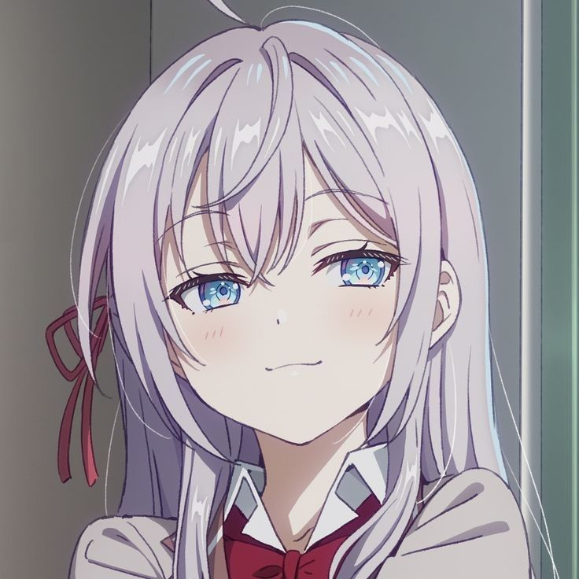
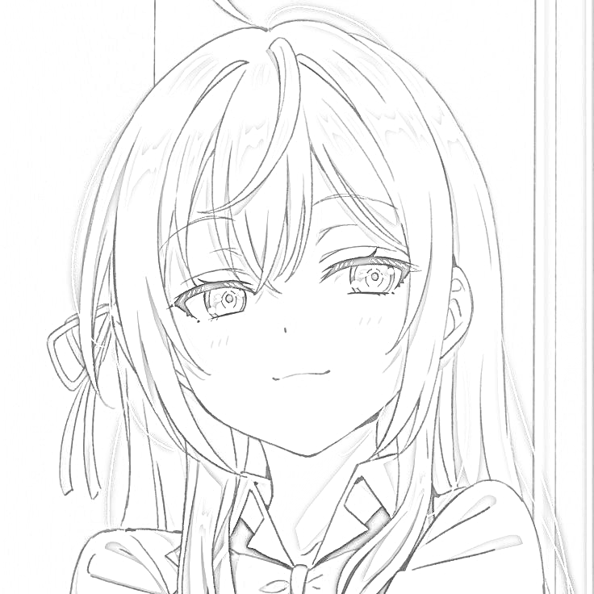

# Pencil Sketch Generator

This project converts a given image into a pencil sketch using OpenCV, a powerful computer vision library in Python. It applies a series of image processing techniques such as grayscale conversion, inversion, blurring, and division to create a hand-drawn sketch effect.

## Features

- Converts any input image into a pencil sketch.
- Simple and easy-to-use function for processing images.
- Supports various input and output image formats (e.g., JPEG, PNG).
- Built using the popular OpenCV library.

## How It Works

1. **Grayscale Conversion**: The input image is converted to grayscale to simplify the processing.
2. **Inversion**: The grayscale image is inverted to highlight the edges.
3. **Blurring**: The inverted image is blurred using a Gaussian filter to smooth out noise.
4. **Inversion of Blur**: The blurred image is inverted again to prepare for the division step.
5. **Division**: The original grayscale image is divided by the inverted blurred image, creating the final pencil sketch effect.

## Prerequisites

- Python 3.6 or higher
- OpenCV library

To install OpenCV, run:
```bash
pip install opencv-python
```

---

## Usage

1. Clone the repository:

   ```bash
   git clone https://github.com/ZAomineZ/pencil_sketcher.git
   cd pencil_sketcher
   ```
2. Place the input image (test.jpeg) in the project directory.
3. Run the script:
   ```bash
   python main.py
   ```
4. The resulting pencil sketch will be saved as sketch.png in the same directory.
5. Customize as needed! You can call the create_sketch() function with your own image paths.

## Example Output

| **Original Image**     | **Pencil Sketch**             |
|------------------------|-------------------------------|
|  |  |